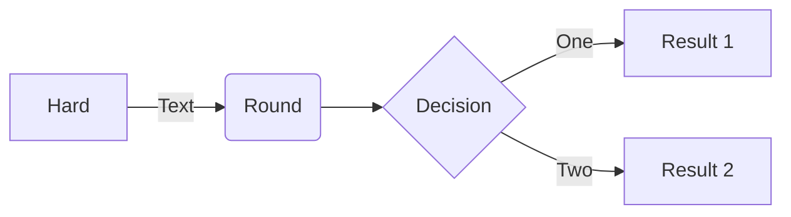
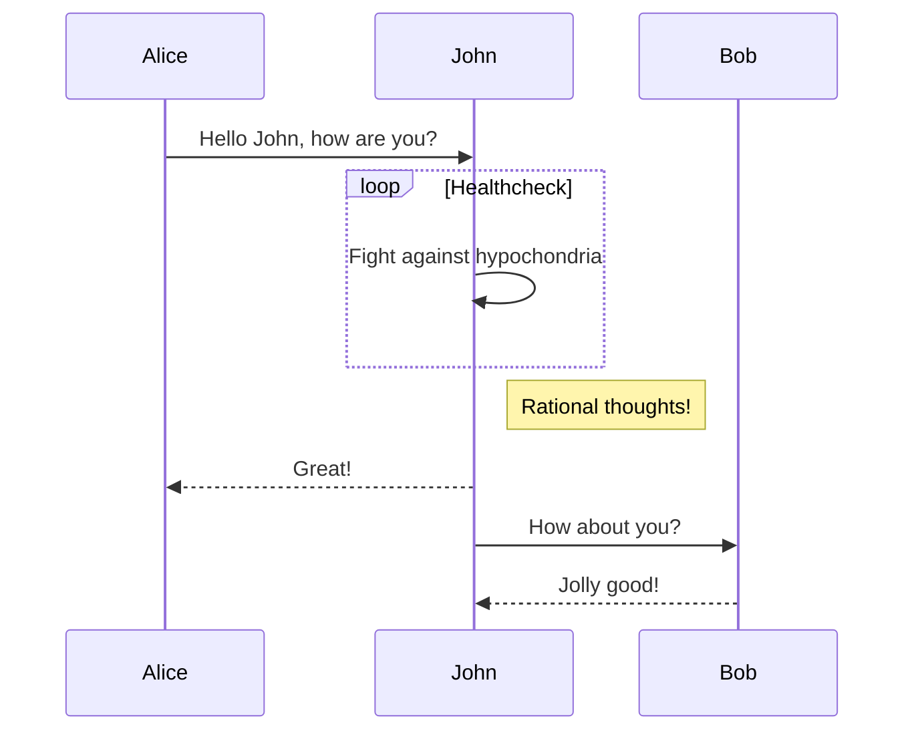

[](https://github.com/adriandeleon/java-playground/actions/workflows/maven.yml)

# Java Playground: A Java testing grounds.

Adrian De Leon <adrian@adriandeleon.me>



Here is another diagram.


Clean the project...
```shell
mvn clean
```

Compile the project...
```shell
mvn compile
```


